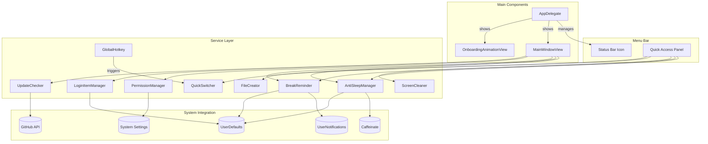
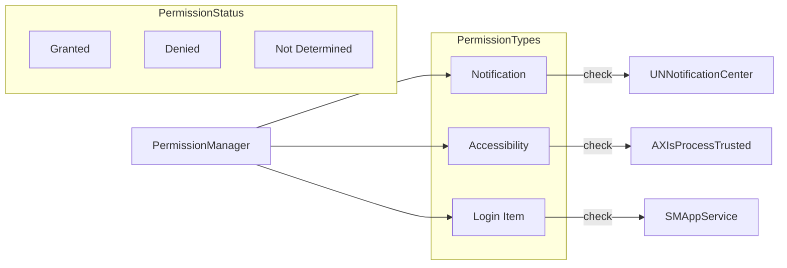

# QuickPod Architecture

## System Architecture



## Component Structure

### AppDelegate
- Entry point of the application
- Manages menu bar status item
- Handles application lifecycle
- Shows onboarding and main windows

### MainWindowView
- Main settings panel
- SwiftUI-based UI
- Contains all feature sections

### Service Managers

| Manager | Responsibility |
|---------|----------------|
| **AntiSleepManager** | Prevent Mac from sleeping using caffeinate |
| **BreakReminder** | Schedule and deliver break reminders |
| **ScreenCleaner** | Full-screen black cleaning mode |
| **QuickSwitcher** | Global hotkey launcher |
| **FileCreator** | Create new files with templates |
| **UpdateChecker** | Check GitHub for updates |
| **PermissionManager** | Check and manage system permissions |
| **LoginItemManager** | Manage login item registration |
| **GlobalHotkey** | Register global keyboard shortcuts |

## Data Flow

### Anti-Sleep Flow
1. User clicks "Keep Awake" button
2. AntiSleepManager starts caffeinate process
3. Status bar icon changes to active state
4. Timer updates remaining time (if timed mode)
5. User clicks "Stop" or timer expires
6. caffeinate process is terminated

### Break Reminder Flow
1. User enables break reminder with interval
2. BreakReminder schedules local notification
3. When time arrives:
   - Show system notification (if enabled)
   - Show alert window (if enabled)
   - Play reminder sound
4. User can:
   - Acknowledge and dismiss
   - Postpone by 5/10 minutes

### Update Check Flow
1. User clicks "Check for Updates"
2. UpdateChecker fetches latest release from GitHub
3. Compares version with current installed version
4. If update available:
   - Shows alert with release notes
   - Provides download button
   - Option to skip this version

## Permission Management



## File Structure

```
QuickPod/
├── Sources/
│   ├── QuickPod/
│   │   ├── main.swift              # Entry point
│   │   ├── AppDelegate.swift       # Application delegate
│   │   ├── MainWindow.swift        # Main settings window
│   │   ├── OnboardingAnimationView.swift
│   │   ├── AntiSleepManager.swift
│   │   ├── BreakReminder.swift
│   │   ├── ScreenCleaner.swift
│   │   ├── QuickSwitcher.swift
│   │   ├── FileCreator.swift
│   │   ├── UpdateChecker.swift
│   │   ├── PermissionManager.swift
│   │   ├── LoginItemManager.swift
│   │   └── GlobalHotkey.swift
│   └── Info.plist                  # App configuration
├── Tools/
│   └── IconGenerator.swift         # Generate app icons
├── build.sh                        # Build script
├── create_dmg.sh                   # DMG packaging
├── README.md                       # Documentation
└── .gitignore
```

## Key Technologies

- **SwiftUI**: Modern UI framework for macOS
- **AppKit**: Native macOS APIs for menu bar and windows
- **UserNotifications**: System notification framework
- **ServiceManagement**: Login item management
- **CoreGraphics**: Screen capture and display
- **URLSession**: Network requests for updates

## Security Considerations

1. **Permissions**: Only request necessary permissions
2. **Data Storage**: Use UserDefaults for preferences only
3. **Network**: HTTPS only for API requests
4. **Sandbox**: App is sandbox-compliant
