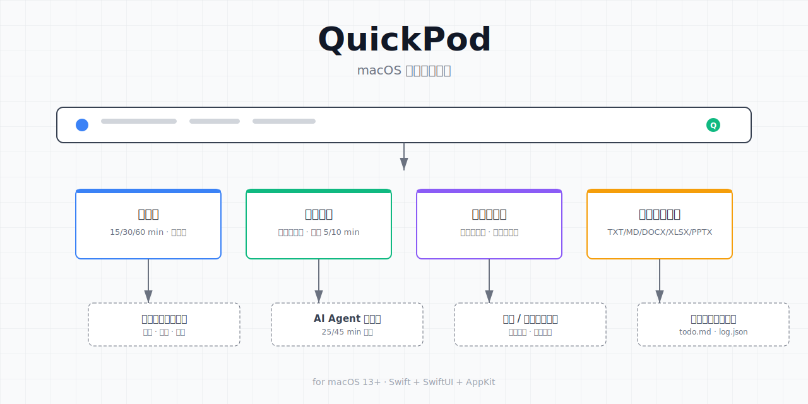

<p align="center">
  <a href="README.md">中文</a> | <a href="README.en.md">English</a>
</p>

<p align="center">
  
</p>

<p align="center">
  A macOS menu bar utility for anti-sleep, break reminders, quick switching, and desktop file creation
</p>

<p align="center">
  <a href="#install">🚀 Install</a> ·
  <a href="#use-cases">📖 Use Cases</a> ·
  <a href="#features">✨ Features</a> ·
  <a href="#development">🔧 Development</a>
</p>

<p align="center">
  <a href="https://github.com/ECdison6227/QuickPod/releases"></a>
  <a href="LICENSE"></a>
</p>

---

## One-click Setup

If you don't want to download manually, paste this prompt into your Coding Agent (Trae / Codex / Claude Code) and let it guide you through a local build:

```text
Please help me build and configure the macOS menu bar app from https://github.com/ECdison6227/QuickPod:

1. Git clone the repo into a temporary directory
2. Run ./build.sh to compile
3. Open build/QuickPod.app and explain the main UI
4. Guide me to set up notification permission and the global hotkey
5. Demo how to enable anti-sleep, set a break reminder, and create a desktop file
```

---

## Table of Contents

- [Who is it for](#who-is-it-for)
- [Features](#features)
- [Use Cases](#use-cases)
- [Install](#install)
- [Permissions](#permissions)
- [Development](#development)
- [Pitfalls](#pitfalls)
- [Changelog](#changelog)
- [Feedback](#feedback)

## Who is it for

- People who run long code generation, builds, downloads, or inference jobs and need their Mac to stay awake
- People using AI agents for long tasks and forgetting to take breaks
- People who want a single menu-bar app to manage anti-sleep, reminders, and quick file creation

## Features

| Feature | Description |
|---------|-------------|
| **Anti-sleep** | Keep your Mac awake with one click; presets for 15 / 30 / 60 min or indefinite |
| **Break reminders** | Custom intervals, 1-minute test, top-right in-app reminder card |
| **Snooze** | Postpone reminders by 5 or 10 minutes |
| **Quick switcher** | Global hotkey, arrow keys to select, Enter to confirm |
| **Create files on Desktop** | TXT / MD / DOCX / XLSX / PPTX with custom extensions |
| **Update check** | Prefer direct DMG/ZIP from Releases; fall back to web redirect when API is rate-limited |

## Use Cases

### Use case 1: Keep your Mac awake during long tasks

You are running a local LLM inference or video export. Closing the lid or locking the screen may put macOS to sleep. Open QuickPod, pick an anti-sleep duration, and the menu bar icon shows the current state.

### Use case 2: Pomodoro-style breaks while an AI agent works

Set a break reminder for 25 or 45 minutes. When the time is up, QuickPod shows both a system notification and its own top-right card so you don't miss it.

### Use case 3: Loop timer for teaching or live demos

After each reminder, you can snooze for 5 or 10 minutes. This also works as a loop timer for lectures, talks, or live demonstrations.

### Use case 4: Quickly create scratch files

Need a quick `todo.md`, `note.txt`, or `log.json`? Hit the global hotkey, choose the file type, and it appears on your Desktop.

## Install

### Method 1: Download a release (recommended)

1. Open [Releases](https://github.com/ECdison6227/QuickPod/releases)
2. Download the latest `.dmg`
3. Drag `QuickPod.app` into `Applications`

### Method 2: Build locally

```bash
git clone https://github.com/ECdison6227/QuickPod.git
cd QuickPod
./build.sh
open build/QuickPod.app
```

## Requirements

- macOS 13 Ventura or later

## Permissions

QuickPod only requires **notification permission** for its core flow:

1. **Notifications**: Used for break reminders, test notifications, and status confirmations.
2. **Accessibility (optional)**: The global hotkey uses Carbon `RegisterEventHotKey`, so accessibility access is optional and only helps with extra keyboard-monitoring scenarios.
3. **Launch at login (optional)**: Enable in settings if you want QuickPod to start automatically.

## Development

### Tech stack

- Swift
- SwiftUI
- AppKit
- UserNotifications
- ServiceManagement

### Build

```bash
./build.sh
```

### Package as DMG

```bash
./create_dmg.sh
```

For implementation details, see [ARCHITECTURE.md](ARCHITECTURE.md).

## Pitfalls

**Unstable notification permission detection**

Early versions relied on `UNUserNotificationCenter` authorization state, which can lag when the user toggles notifications manually. v1.2 proactively requests authorization on critical paths and adds a fallback.

**Global hotkey not responding**

If another app already uses the same shortcut, QuickPod does not warn you. Try a different combination first, such as `Cmd+Shift+Space`.

**Reminder panel hidden by other windows**

The break-reminder card is an `NSPanel` shown at the top-right of the screen. Some fullscreen utilities or window managers may cover it. Switching to a normal desktop usually fixes it.

## Changelog

### v1.2

- Fixed unstable notification permission detection
- Added the top-right reminder card
- Added custom reminder minutes and a 1-minute test flow
- Added custom file extensions
- Refreshed status bar ring style and onboarding assets

### v1.0.0

- Initial release

## Feedback

- Bugs or feature requests: open an [Issue](https://github.com/ECdison6227/QuickPod/issues)
- Security issues: email `2014184720@qq.com`; do not open a public issue
- Architecture and development: see [ARCHITECTURE.md](ARCHITECTURE.md) and [CONTRIBUTING.md](CONTRIBUTING.md)

## License

MIT License. See [LICENSE](LICENSE).
